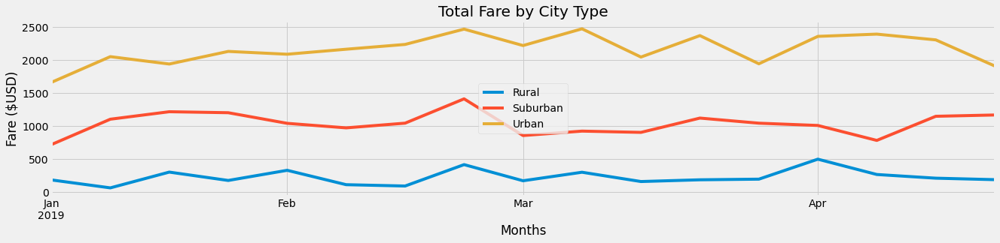

# PyBer Analysis

## Background
V. Isualize has given me and Omar a brand-new assignment. Using my Python skills and knowledge of Pandas, I have to create a summary DataFrame of the ride-sharing data by city type. Then, using Pandas and Matplotlib, create a multiple-line graph that shows the total weekly fares for each city type. Finally, I will submit a written report that summarizes how the data differs by city type and how those differences can be used by decision-makers at PyBer.

## Overview of Project
Deliverables for the analysis of the school district:
* create a summary DataFrame of the ride-sharing data by city type
* create a multiple-line graph that shows the total weekly fares for each city type
* summarizes how the data differs by city type and how those differences can be used by decision-makers at PyBer

### Purpose

Results:
* Summary DataFrame of the ride-sharing data by city type
* multiple-line graph that shows the total weekly fares for each city type
* Summary of  how the data differs by city type and how those differences can be used by decision-makers at PyBer

## Analysis And Challenges

## Methodology: Analytics Paradigm

#### 1. Decomposing the Ask
We have 2 datasets that shows:
* city_data.csv -  city name, driver counts in the city, type of city_data
* ride_data.csv -  city name, date of each ride, fare of each ride, ride id
After we merged these 2 datasets, we will be able to generate summaries for the rides by city type and visualise total weekly fares for each city type.

#### 2. Identify the Datasource
* city_data.csv
* ride_data.csv

#### 3. Define Strategy & Metrics
**Resource:** Python 3.6, Anaconda, Jupyter Notebook

1. Merge the 2 datasets
1. Find total rides, total drivers, total fares, average fare per ride and average fare per driver.
1. Find the sum of fares by city type and dates
1. Group the fares weekly for date between '2019-01-01' and '2019-04-28'
1. Create a multiple line chart for the weekly fares data above.

 #### 4. Data Retrieval Plan
Read CSV with pandas
```
city_data_to_load = "resources/city_data.csv"
ride_data_to_load = "resources/ride_data.csv"
city_data_df = pd.read_csv(city_data_to_load)
ride_data_df = pd.read_csv(ride_data_to_load)

```

#### 5. Assemble & Clean the Data
* Merge the 2 datasets
* Group by city type and dates
* Visualise


#### 6. Analyse for Trends
Analyse trends for 2019 Q1 between the different city types.

#### 7. Acknowledging Limitations
* Self limitations with matplotlib, therefore reference Stackover Flow multiple times.

#### 8. Making the Call:
The "Proper" Conclusion is indicated below on [Summary](#summary)

## Analysis

Below is the summary of rides, drivers and fares by city types from the 2 datasets received.

>Summary of Rides, Drivers & Fares by City Types


From this summary, we can see that rural cities have the lowest number of rides and drivers but highest average fare per ride at $34.62 and highest average fare per driver at $55.49.
Even though urban cities have the highest total rides and total drivers, the average fare per ride and average fare per driver is the lowest among all city types. When we examine closer at the data, urban city type has more drivers, total of 2405, than rides, total of 1625. This means there is 48% more drivers to rides hailed.
The other 2 city types have higher rides compare to drivers respectively.


>Total Fare by City Type between 2019-01-01 to 2019-04-28



From the graph above, we can see that the trends for all 3 city types are pretty consistent with small peaks throughout for each city types but nothing major which may lead to potential low drivers resources in each city types.

## Summary

Due to urban cities density, it makes sense that there are more rides, however there are 48% more drivers in urban cities compared to rides. On top of that, average fare per ride in urban cities is only $24.53, where driver is only getting average $16.57. This means the _**average fare per driver in rural and suburban cities is 2.3 to 3.3 times more**_ than average fare per driver in urban cities.

In both suburban and rural cities, average fare per driver is higher than average fare per ride. This means that most drivers in suburban and rural cities are getting more rides or business compared to urban drivers or that each rides is longer than the rides in urban cities.  This means driver who _**drives for suburban and/or rural cities have more ride hails / business and can earn more per each ride compared to urban rides**_.

Based on the results above, these are the 3 business recommendations for PyBer CEO to address disparities among city types.

1. Change the app to incentivise urban drivers who has a ride ending at suburban / rural cities to _**continue serving rides that starts and ends at suburban / rural cities at the surrounding areas**_.
1. _**Add an option for urban drivers who prefers to serve longer rides**_ so they can earn higher average per ride, to opt-in and therefore all / most of their rides will be for rides in suburban / rural cities.
1. Create and option to _**redistribute drivers resource during different peak hours to receiving rides from closest adjacent suburban / rural cities**_. This means during peak hours in suburban / rural cities, urban drivers will be eligible to receive rides for suburban / rural to redistribute driver resources from urban to suburban / rural.


## Appendix
